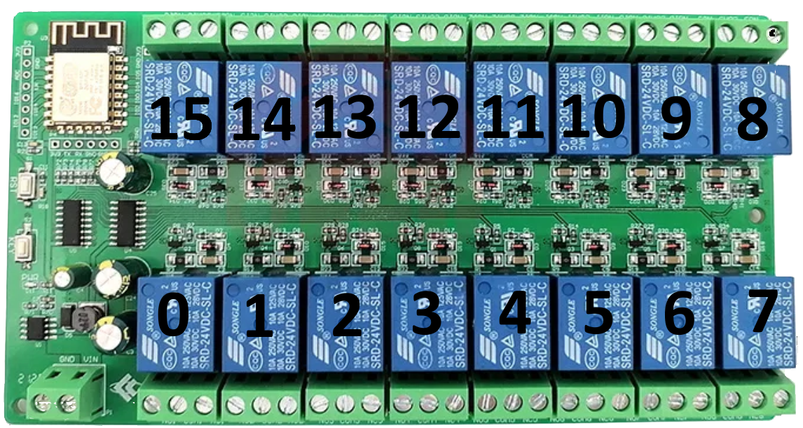

# smart-lift

This project is a web application to smartify multiple car lifts. 

It is written in Python and uses FastAPI as a web framework. The frontend is written in HTML and Javascript and uses websockets to communicate with the server.

The server communicates to one or more controllers with websockets too. The controllers are relais boards using ESP8266's and are programmed using Arduino.

This system is made for double parking lifts that have 3 actions each: up, down and lock. Each relais on the board simulates a button press for the lift.

My lifts came with an annoying keyswitch with bad placement. I removed them all, made a custom Box with 3 buttons for every lift. That way every lift can be controlled from one place or with your smartphone. Each button is in parallel to every relais, so both are functional.

<p float="left">
  
  
</p>


## Getting Started
- Clone the repository and install all dependencies (Docker, [Arduino librarys](#dependencies)). 
```bash
$ git clone https://github.com/git-eri/smart-lift.git
```
- Copy the [defaults.h](esp12f/defaults.h) and rename the file to settings.h. Edit the [settings.h](#settingsh) to fit your needs.
- Programm your controller board(s) with the sketch [esp12f.ino](esp12f/esp12f.ino) that is using your settings.
- Run the [deploy.sh](deploy.sh) script
```bash
$ cd smart-lift
$ ./deploy.sh
```
- The docker container should be up and running. Now you can turn on your programmed controllers and access the interface in your browser on port ```8000```


## Development

### What you need

- Docker
- Python 3.10
- Any Relais Board based on ESP8266

Lint before commit!
```bash
$ pylint app
```

### Server
The server handles the communication between the controllers and the clients.

#### Development (Local - uvicorn)

For local testing

```bash
$ cd app
$ uvicorn app.main:app --host=0.0.0.0 --port=8000 --log-config=app/log_conf.yml
```

#### Development (Docker)

```bash
$ cd app
$ ./run-docker.sh
```

### Controller (ESP8266)

#### Relaisboard & Layout



#### Dependencies

- [Arduino IDE](https://www.arduino.cc/en/software)
- ESP8266 (https://dl.espressif.com/dl/package_esp32_index.json)
- [ArduinoJson](https://arduinojson.org/)
- [WebSockets](https://github.com/gilmaimon/ArduinoWebsockets)


#### settings.h
```c
// Controller ID: must be unique!
const String con_id = "con1";
// Lifts start from 0. If controller handles lifts 6-10 it must be 5.
const uint8_t lift_begin = 0;
// Lift count: How many lifts the controller handles.
const uint8_t lift_count = 5;
// Which relais-id's for which lift, they are in order of the lifts.
// This example is for a 16 relais board with 5 connected lifts per controller.
// Each lift uses 3 relais (up, down, lock).
const uint8_t lifts[lift_count][3] = { {15,14,13},
                                       {12,11,10},
                                       {9,8,6},
                                       {5,4,3},
                                       {2,1,0}
                                      };
// Wifi connections
// If you have more than one Wifi connection, change the 1 to the number of connections.
const String networks[1][4] = { {"SSID","Password","Server IP","Server Port (8000)"},
                               };
```


### What needs to get tested?
- [ ] Checks for invalid calls
- [ ] Checks for leaks
