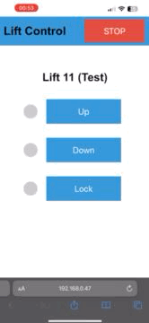

# smart-lift

This project is a web application to smartify multiple car lifts. 

It is written in Python and uses FastAPI as a web framework. The frontend is written in HTML and Javascript and uses websockets to communicate with the server.

The server communicates to one or more controllers with websockets too. The controllers are relais boards using ESP8266's and are programmed using Arduino.

This system is made for double parking lifts that have 3 actions each: up, down and lock. Each relais on the board simulates a button press for the lift.

| Mobile  | Desktop |
| ------------- | ------------- |
|   |   |

My lifts came with an annoying keyswitch with bad placement. I removed them all, made a custom Box with 3 buttons for every lift. That way every lift can be controlled from one place or with your smartphone. Each button is in parallel to every relais, so both are functional.

| Inside  | Front |
| ------------- | ------------- |
|   |   |

This setup is just tested for that specific [relais board](#relaisboard--layout) but the settings are easily adaptable to interface with boards with more or less relais.

## Getting Started
- Clone the repository and install all dependencies (Docker, [Arduino librarys](#dependencies)). 
```bash
$ git clone https://github.com/git-eri/smart-lift.git
```
- Copy the [defaults.h](esp12f/defaults.h) and rename the file to settings.h. Edit the [settings.h](#settingsh) to fit your needs.
- Programm your controller board(s) with the sketch [esp12f.ino](esp12f/esp12f.ino) using your own settings.
- Run the [deploy.sh](deploy.sh) script
```bash
$ cd smart-lift
$ ./deploy.sh
```
- The docker container should be up and running. Now you can turn on your programmed controllers and access the interface in your browser on port ```8000```. You should see the lifts being addded to the interface as the controllers connect to the server.
- If you reached this step, you may now figure out how to interface with your lift. My lift was controlled using a key switch which i just replaced with the box shown above and connected everything up. You could also use one controller with at least 3 relais for every lift.

### Docker Compose
If you want to use a complete stack with grafana and prometheus for monitoring then just use ```docker compose up --build``` to start the stack.

## Development

### What you need

- Docker
- Python 3.10
- Any Relais Board based on ESP8266

Linting before commit
```bash
$ pylint app
```

### Server
The server handles the communication between the controllers and the clients.

#### Development (Local - uvicorn)

For local testing

```bash
$ uvicorn app.main:app --host=0.0.0.0 --port=8000 --log-config=app/log_conf.yml
```
Consider using the ```--reload``` flag for hot reloading with uvicorn.

Generating Certificates for SSL
```bash
$ openssl req -x509 -nodes -days 730 -newkey rsa:2048 -keyout server.key -out server.crt  -subj "/CN=update.example.com"
```

Testing with https updates
```bash
$ uvicorn app.main:app --host=0.0.0.0 --port=8000 --log-config=app/log_conf.yml --ssl-keyfile='app/certs/server.key' --ssl-certfile='app/certs/server.crt'

#### Development (Docker)

```bash
$ ./run-docker.sh
```

#### lift_info.json

This file is used by the frontend so you can name your lifts. Change this file accordingly to your setup.

```json
{
    "lifts": [
        {
            "id": 0,
            "name": "Lift 1"
        },
        {
            "id": 1,
            "name": "Lift 2"
        }
    ]
}
```

### Controller (ESP8266)

#### Relaisboard & Layout


#### Dependencies

- [Arduino IDE](https://www.arduino.cc/en/software)
- ESP8266 (https://dl.espressif.com/dl/package_esp32_index.json)
- [ArduinoJson](https://arduinojson.org/)
- [WebSockets](https://github.com/Links2004/arduinoWebSockets)

### Build & Upload

Using the [ESP8266 board manager](https://arduino-esp8266.readthedocs.io/en/latest/installing.html), install the ESP8266 board. Then install the ArduinoJson and WebSockets librarys. Using the NodeMCU 1.0 (ESP-12E) board, upload the sketch [esp12f.ino](esp12f/esp12f.ino) to your controller.

#### settings.h
```c
// Controller ID: must be unique!
const String con_id = "con1";
// Lifts start from 0. If controller handles lifts 6-10 it must be 5.
const uint8_t lift_begin = 0;
// Lift count: How many lifts the controller handles.
const uint8_t lift_count = 5;
// Which relais-id's for which lift, they are in order of the lifts.
// This example is for a 16 relais board with 5 connected lifts per controller.
// Each lift uses 3 relais (up, down, lock).
const uint8_t lifts[lift_count][3] = { {15,14,13},
                                       {12,11,10},
                                       {9,8,7},
                                       {6,5,4},
                                       {3,2,1}
                                      };
// Wifi connections
// If you have more than one Wifi connection, change the 1 to the number of connections.
const String networks[1][4] = { {"SSID","Password","Server IP","Server Port (8000)"},
                               };
```

### Controller Simulator

For testing and debugging purposes there is a controller simulator. It can be accessed at ```/sim#0-5```. You can change the number of lifts by changing the numbers after the URI fragment (```#```). The Page will then simulate a controller with the given range of lifts. It responds like a controller and the indicator lights will light up when a lift is moving.

### Known Issues
- [ ] Controller has to check if a client has disconnected while a lift is moving. Currently the relais will stay on and the client has to reconnect to stop the lift.
- [ ] The mobile frontend has to act in a safe way when a controller get's disconnected. Currently if a controller gets disconnected, the disconnected lifts disappear and the ui will move to the other controller. If a button was held down at this time, the lift which is now shown will then move. This needs to be fixed. 
  - Maybe leave the disconnected lifts but grey them out, and show a message so the button press is aborted. Then the lifts can be removed after a timeout.
- [ ] The frontend doesn't sort the lifts by id. This needs to be fixed. Currently the lifts are sorted by the time the controller connected first.

### What needs to get tested?
- [ ] Checks for invalid calls
- [ ] Checks for leaks
- [ ] Checks for invalid input
- [ ] Checks for race conditions

### What needs to get done?
- [ ] Add monitoring (Prometheus, Grafana)
- [ ] Add unit testing
- [ ] Use secure websockets (wss)
- [ ] Add Authorization (Let the controller check the authenticity of the server)
